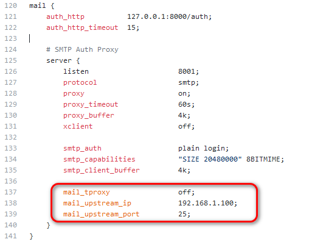
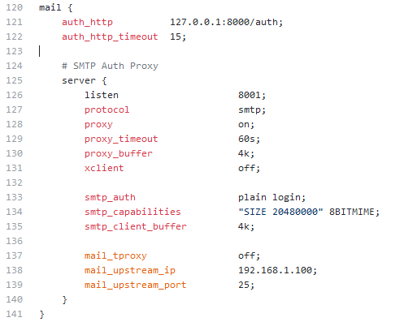
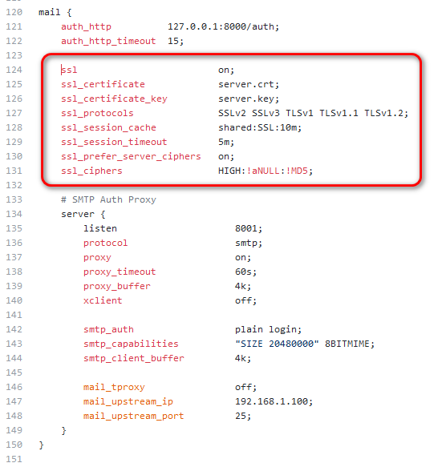
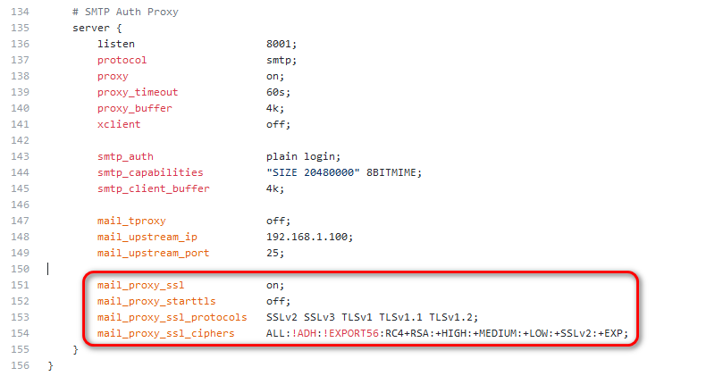
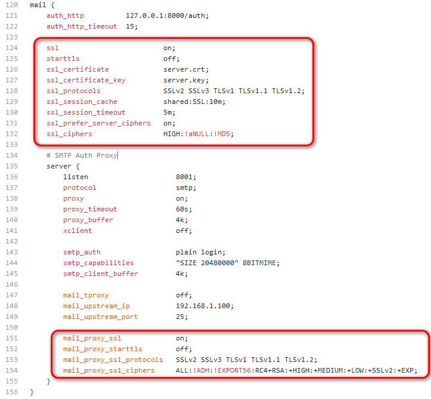

# Nginx邮件代理

## 一、编译
```
./configure --prefix=/usr/local/nginx-1.11.10 --with-mail --with-mail_ssl_module
```

## 二、通过如下配置：下游客户端与上游服务器直接进行认证，跳过本地认证过程


### 1、下游客户端与nginx普通连接，nginx与上游服务器普通连接


### 2、下游客户端与nginx SSL连接，nginx与上游服务器普通连接


### 3、下游客户端与nginx普通连接，nginx与上游服务器SSL连接


### 4、下游客户端与nginx SSL连接，nginx与上游服务器SSL连接


***【注】<br>***
***1、后续将继续支持STARTTLS方式***
***2、后续将支持透明代理模式***
